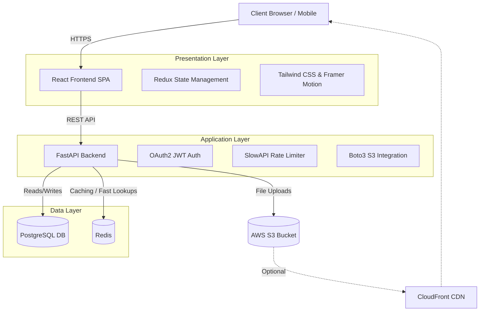

# 🧠 BareMind

> A premium, scalable, and highly secure modern publishing platform.

BareMind is a full-stack platform designed to handle high-throughput content delivery while providing an ultra-premium user experience. It leverages enterprise-grade system design concepts to ensure performance, security, and scalability.

---

## 🏗️ System Architecture

BareMind relies on a decoupled microservices-inspired architecture designed to scale up to millions of users. 



---

## 🚀 Key System Design Implementations

### 1. View Count Deduplication (Redis)
To prevent artificial inflation of blog view counts via page refreshing or spamming, BareMind employs a professional **fingerprinting mechanism** backed by Redis:
- **Logged-in Users**: Fingerprinted by `user_id`.
- **Guest Users**: Fingerprinted by hashing a combination of their `IP address` and `User-Agent`.
- **TTL Caching**: A record is stored in Redis (`view:blog_{id}:{fingerprint}`) with a **24-hour TTL (Time-To-Live)**. The PostgreSQL database is only incremented if the Redis key does not exist, keeping database I/O extremely lightweight and ensuring 1 real view = 1 count per day.

### 2. O(1) Real-Time Validation (Redis Bloom Filters)
To provide Instagram/Twitter-style instant feedback during registration, we use a **Redis-backed Bloom Filter** for username availability:
- Instead of hitting the PostgreSQL database for every keystroke, the frontend debounces input and pings the backend.
- The backend checks the Bloom Filter in `O(1)` time.
- This prevents Database CPU spikes during high-traffic registration events and provides instantaneous UI feedback.

### 3. Scalable Asset Delivery (AWS S3)
Images and avatars are offloaded from the core application server to **Amazon S3**:
- **Hierarchical Storage**: Images are stored cleanly as `{folder}/{user_id}/{filename}.webp`.
- **Optimization**: Images are automatically converted to WebP formats and EXIF data is stripped before upload to save bandwidth and protect privacy.
- **CDN-Ready**: The system is pre-configured to seamlessly switch to a CDN (like CloudFront) to serve images via Edge nodes globally.

### 4. Advanced Rate Limiting & DoS Protection
To protect against brute-force attacks, credential stuffing, and volumetric DoS attacks:
- **IP-Based Throttling**: Implemented via `slowapi`. Auth routes are limited to `5 requests/minute`, and image uploads are restricted to `20 uploads/day` per IP.
- **Payload Limits**: All API endpoints use strict Pydantic schemas with `max_length` properties to prevent memory-exhaustion attacks via massive payload injections.
- **Bcrypt Hardening**: Hard-capped password lengths (`64 bytes`) to mitigate the known 72-byte truncation vulnerability in standard `bcrypt` hashing.

### 5. Frontend Content Protection
To protect creator content from casual scraping and theft:
- **UI Locking**: Global CSS rules (`user-select: none`, `-webkit-user-drag: none`) prevent text and image highlighting/dragging.
- **Context-Menu Interception**: A global DOM event listener intercepts and neutralizes the native right-click context menu solely on `` tags, disabling the "Save Image As" functionality.

### 6. Seamless & Secure Authentication
- **Dual-Token System**: Short-lived JWT Access Tokens served to memory (Redux), and long-lived Refresh Tokens stored in ultra-secure **HttpOnly Cookies** (mitigating XSS attacks).
- **Silent Refresh**: The React application silently rotates access tokens in the background via Axios interceptors, ensuring a premium, uninterrupted user experience.

---

## 🛠️ Technology Stack

### Frontend
* **React 18** (Vite)
* **Redux Toolkit** (State Management)
* **Tailwind CSS** (Styling & Design System)
* **Framer Motion** (Micro-animations)
* **Lucide React** (Iconography)

### Backend
* **Python 3.10+ & FastAPI** (High-performance async API)
* **SQLAlchemy** (ORM)
* **PostgreSQL** (Relational Database)
* **Redis / aioredis** (In-memory Caching & Bloom Filters)
* **Boto3** (AWS S3 Cloud Storage)

---

## 💻 Local Setup

### 1. Clone & Install
```bash
git clone https://github.com/your-org/BareMind.git
cd BareMind
```

### 2. Backend Environment
```bash
cd backend
python -m venv venv
source venv/bin/activate  # On Windows: venv\Scripts\activate
pip install -r requirements.txt
```
*Configure your `.env` file with PostgreSQL, Redis, and AWS S3 credentials.*
```bash
uvicorn app.main:app --reload
```

### 3. Frontend Environment
```bash
cd frontend
npm install
npm run dev
```

---
*Built with architecture in mind. Ready to scale.*
