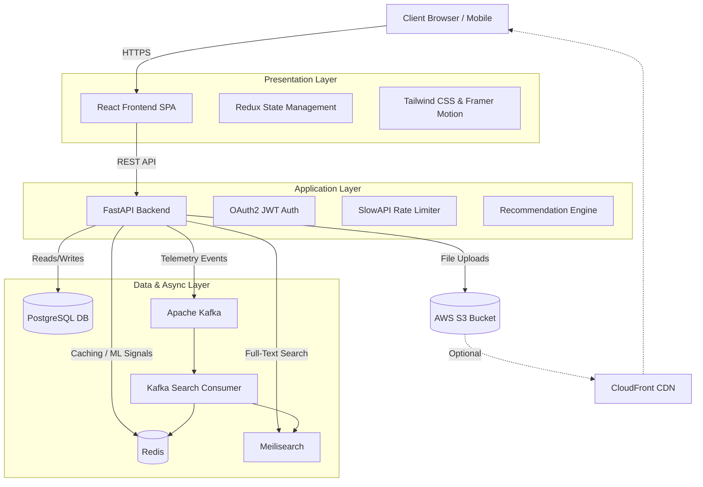
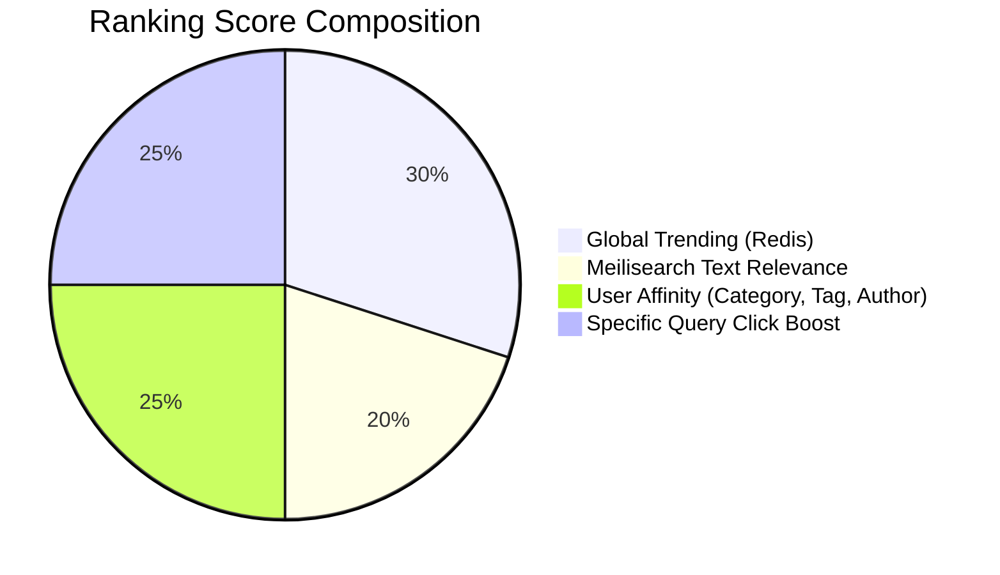

<div align="center">
  
  <h1>🧠 BareMind</h1>
  <p><strong>A premium, scalable, and highly secure modern publishing platform.</strong></p>
  <p>
    
    
    
    
    
  </p>
</div>

<br />

**BareMind** is a full-stack platform designed to handle high-throughput content delivery while providing an ultra-premium user experience. It leverages enterprise-grade system design concepts to ensure performance, security, and scalability, rivaling platforms like Medium and Hashnode.

---

## 🏗️ Master System Architecture

BareMind relies on a decoupled microservices-inspired architecture designed to scale up to millions of users, utilizing Kafka for asynchronous telemetry and Redis for high-speed in-memory ML ranking.



---

## 🚀 Key System Design Implementations

### 1. Intelligent Search & Personalization (Kafka + Redis + Meilisearch)
Our search and ranking system is built on zero direct DB hits for ranking.
- **Meilisearch** provides fuzzy/typo-tolerant full-text matching to generate an initial candidate pool.
- **Kafka** handles asynchronous telemetry. Every view, like, comment, bookmark, and search click is published to a Kafka topic (`search_indexing`).
- **Redis** powers real-time personalization, tracking trending scores, click history, user affinity vectors, and viewed history.

### 2. View Count Deduplication (Redis)
To prevent artificial inflation of blog view counts, BareMind employs a professional **fingerprinting mechanism**:
- **Logged-in Users**: Fingerprinted by `user_id`.
- **Guest Users**: Fingerprinted by `IP + User-Agent` hash.
- **TTL Caching**: Redis stores `view:blog_{id}:{fingerprint}` with a **24-hour TTL**. Database I/O is kept ultra-lightweight.

### 3. O(1) Real-Time Validation (Redis Bloom Filters)
For Instagram/Twitter-style instant feedback during registration:
- Frontend debounces input and pings the backend.
- Backend checks a **Redis-backed Bloom Filter** for username availability in `O(1)` time, preventing database CPU spikes.

### 4. Scalable Asset Delivery (AWS S3)
Images and avatars are offloaded from the core application server to **Amazon S3**:
- Automatically converted to WebP.
- EXIF data stripped for privacy.
- Ready for CloudFront CDN integration.

### 5. Advanced Rate Limiting & DoS Protection
- **IP-Based Throttling**: Implemented via `slowapi` (e.g., Auth limited to 5 req/min, Uploads to 20/day).
- **Payload Limits**: Strict Pydantic schemas with `max_length`.
- **Bcrypt Hardening**: Hard-capped password lengths (64 bytes).

### 6. Frontend Content Protection & Security
- **Dual-Token System**: Short-lived JWT Access Tokens (memory) and long-lived Refresh Tokens (HttpOnly Cookies).
- **Silent Refresh**: Axios interceptors rotate tokens seamlessly in the background.
- **UI Locking**: CSS and JS rules to prevent text highlighting and image dragging/saving to protect creator content.

---

## 📈 Search Ranking & Personalization Algorithm

Our bespoke recommendation engine ranks feeds and search results in-memory dynamically for each user.



The algorithm evaluates:
1. **Textual Relevance** from Meilisearch.
2. **Global Trending Score**: `views + (likes * 10)`.
3. **Query-Specific Click Boost**: Massive multiplier for exact matches users clicked previously.
4. **Behavioral Personalization**: Computed against the user's affinity profile in Redis (`user:{id}:affinity:category`).
5. **Time Decay (Gravity)**: Based on Hacker News gravity formula to favor fresh content.
6. **Read-History Penalty**: Down-ranks already viewed posts to keep the feed fresh.

---

## 🛠️ Technology Stack

| Layer | Technologies |
|---|---|
| **Frontend** | React 18 (Vite), Redux Toolkit, Tailwind CSS, Framer Motion, shadcn/ui, TanStack Query |
| **Backend** | Python 3.10+, FastAPI, SQLAlchemy, Pydantic, Celery |
| **Databases** | PostgreSQL 15, Redis / aioredis |
| **Message Broker** | Apache Kafka (aiokafka) |
| **Search Engine** | Meilisearch |
| **Cloud Storage** | AWS S3 (Boto3) |

---

## 📦 Core Features

### 👤 User Capabilities
- **Authentication**: JWT, Refresh Tokens, Email Verification, Password Reset.
- **Profile Management**: Avatars, Bios, Social Links, Followers/Following.
- **Dashboard**: Track views, likes, comments, and follower metrics.

### ✍️ Content Creation
- **Rich Text Editor**: Support for headings, bold, italic, code blocks, tables, images, markdown, and quotes.
- **Blog Management**: Drafts, auto-saves, SEO-friendly slugs, categories, tags, and cover images.
- **Engagement**: Like, Bookmark, Share, Comment, Nested Replies.

### 🌐 Discovery & Admin
- **Homepage**: Featured, Trending, Latest Blogs, Popular Categories.
- **Advanced Search**: Search by Title, Category, Tag, Author with Real-time Suggestions.
- **Admin Panel**: Complete control over users, content moderation, reports, and global analytics.

---

## 💻 Local Setup & Development

### 1. Clone & Environment Setup
```bash
git clone https://github.com/your-org/BareMind.git
cd BareMind
```

### 2. Start Infrastructure (Docker)
Ensure Docker is installed and running.
```bash
cd docker
docker-compose up -d
```
*This starts PostgreSQL, Redis, Kafka, Meilisearch, pgAdmin, Redis Commander, and Mailpit.*

### 3. Backend Setup
```bash
cd backend
python -m venv venv
# Windows: .\venv\Scripts\activate
# Mac/Linux: source venv/bin/activate
pip install -r requirements.txt
```
*Configure your `.env` file with DB, Redis, Kafka, Meili, and AWS S3 credentials, then start the server:*
```bash
uvicorn app.main:app --reload --host 0.0.0.0 --port 8000
```

### 4. Frontend Setup
```bash
cd frontend
npm install
npm run dev
```

---

<div align="center">
  <i>Built with architecture in mind. Ready to scale to millions.</i>
</div>
